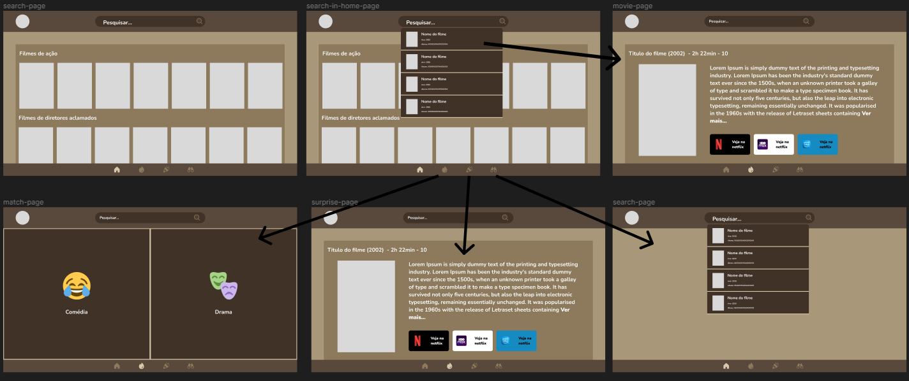
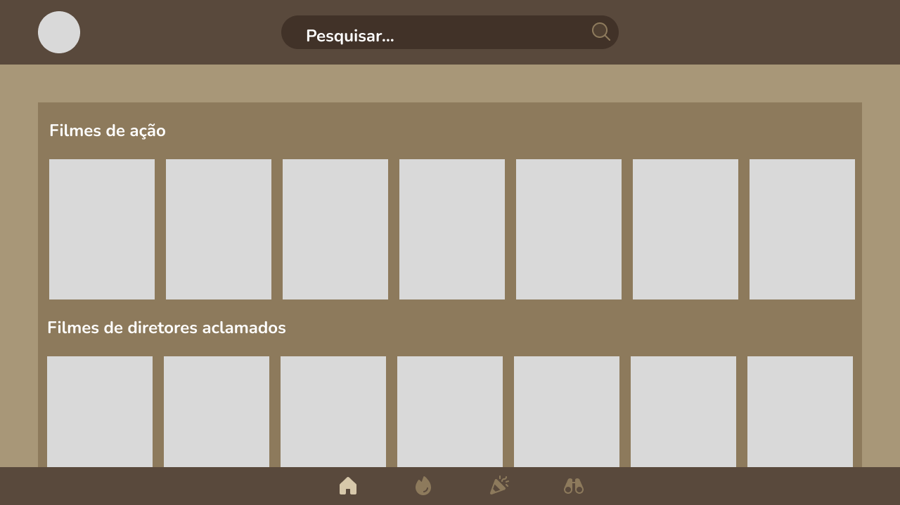
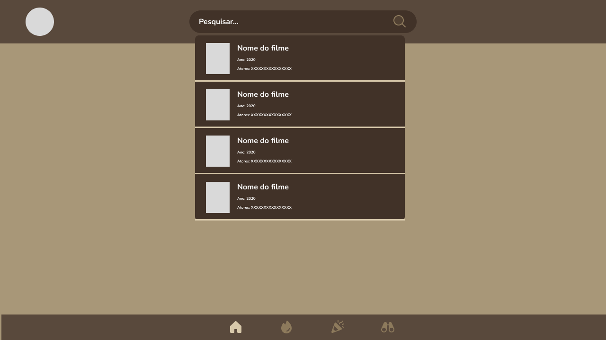
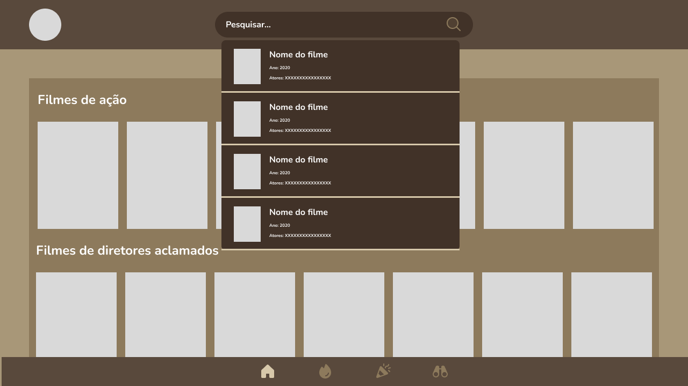
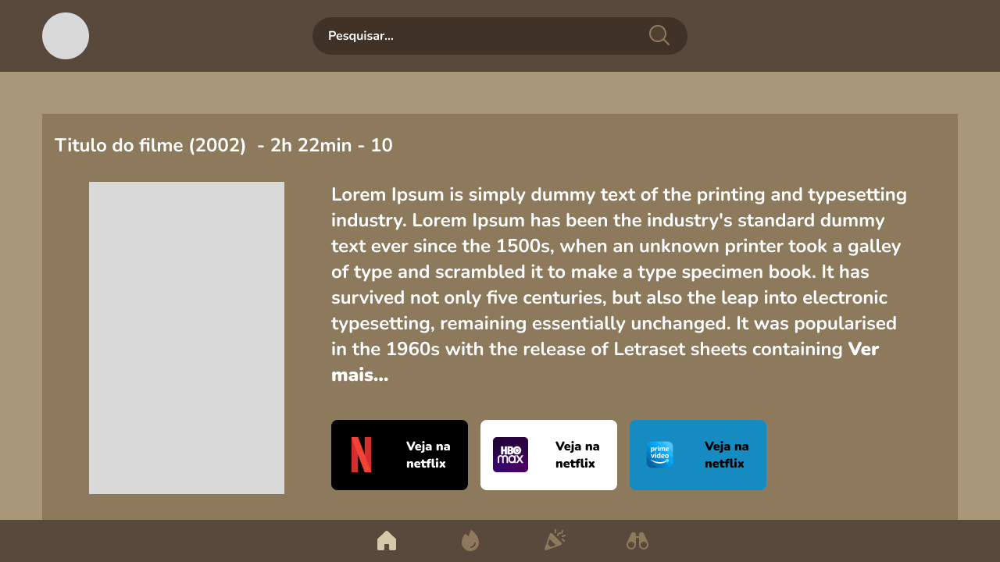
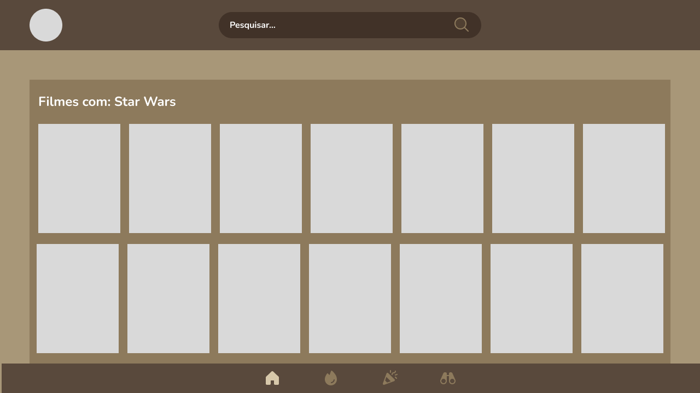
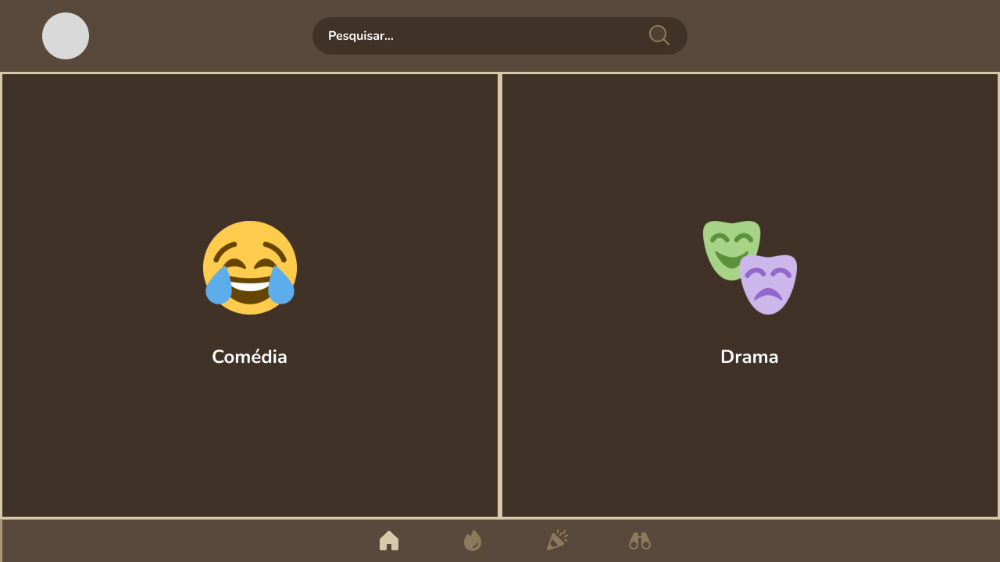

# Projeto de Interface

Dentre as preocupações para a montagem da interface do sistema, estamos estabelecendo foco em questões como agilidade, usabilidade. Desta forma, o projeto tem uma identidade visual padronizada em todas as telas que são projetadas para funcionamento em desktops e dispositivos móveis. A ideia é fazer com que o usuário fique no site o menor tempo possível.

## User Flow

O diagrama apresentado na Figura 2 mostra o fluxo de interação do usuário pelas telas do sistema. Cada uma das telas deste fluxo é detalhada na seção de Wireframes que se segue. Para visualizar o wireframe interativo,<a href="2-Especificação do Projeto.md"> acesse este link. </a>

## Wireframes

### Tela - Home page

A tela de home-page mostra recomendações de filmes por categorias 
 elementos distintos:
Componente de pesquisa que permite pesquisar por nome, diretor, gênero, ator;
Componente de conteúdo exibindo recomendação de filmes sem a necessidade de pesquisa;

### Tela - Tela de busca

A tela de busca será uma tela separada e acoplada a tela inicial onde a pessoa vai escrever um filme/série/ator/diretor e poder selecionar algum da recomendação ou pesquisar pelo nome.

### Resultado de Pesquisa

Assim que o usuário selecionar algum filme da recomendação ele será direcionado para a tela exibindo informações do filme e onde os assistir(primeira figura). Ou se ela clicar na lupa irá para a tela de resultados

### Página de Match

Assim que o usuário selecionar algum filme da recomendação ele será direcionado para a tela exibindo informações do filme e onde os assistir(primeira figura). Ou se ela clicar na lupa irá para a tela de resultados

 
