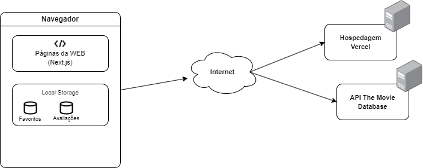

# Arquitetura da Solução

Nesta seção são apresentados os detalhes técnicos da solução criada pela equipe, tratando dos componentes que fazem parte da solução e do ambiente de hospedagem da solução.

## Diagrama de componentes

Os componentes que fazem parte da solução são apresentados na Figura 9.

</img>

Figura 09 - Arquitetura da Solução

A solução implementada conta com os seguintes módulos:
- **Navegador** - Interface básica do sistema  
  - **Páginas Web** - Aplicação em Next.js que corresponde ao front-end, além dos assets e recursos utilizados pela mesma.
   - **Local Storage** - armazenamento mantido no Navegador, onde são implementados bancos de dados baseados em JSON. São eles: 
     - **Favoritos** - mídias favoritados pelo usuário 
     - **Avaliações** - notas atribuídas às mídias que o usuário avaliou
 - **TMDB API** - API externa que permite o acesso aos dados das peças de mídia referenciadas no projeto.
 - **Hospedagem** - local na Internet onde as páginas são mantidas e acessadas pelo navegador. 

## Tecnologias Utilizadas

Nesse projeto será utilizado, para o desenvolvimento do front-end, o ecossistema Javascript, mais especificamente, o framework Next.js, que é um robusto framework de desenvolvimento WEB. Para persistência dos dados que forem necessários, como favoritos do usuário, avaliações, dentre outros, será utilizado o sistema de Local Storage do navegador, onde dados podem ser armazenados em formato de texto simples ou JSON. Por fim, para a hospedagem, será utilizada a plataforma da Vercel, que possui um plano de hospedagem gratuito generoso e amplamente utilizado.

## Hospedagem

O site utiliza a plataforma da Vercel como ambiente de hospedagem do site do projeto. O site é mantido no ambiente da seguinte URL: [URL da hospedagem](https://pmv-ads-2023-1-e1-proj-web-t12-projeto-serie.vercel.app)

A publicação do site na Vercel é integrada com o repositório de código no GitHub, de modo que ações de push para a branch main disparam eventos de deploy automáticos. A URL do repositório Git se encontra abaixo. 

[URL do repositório](https://github.com/ICEI-PUC-Minas-PMV-ADS/pmv-ads-2023-1-e1-proj-web-t12-projeto-serie.git)
