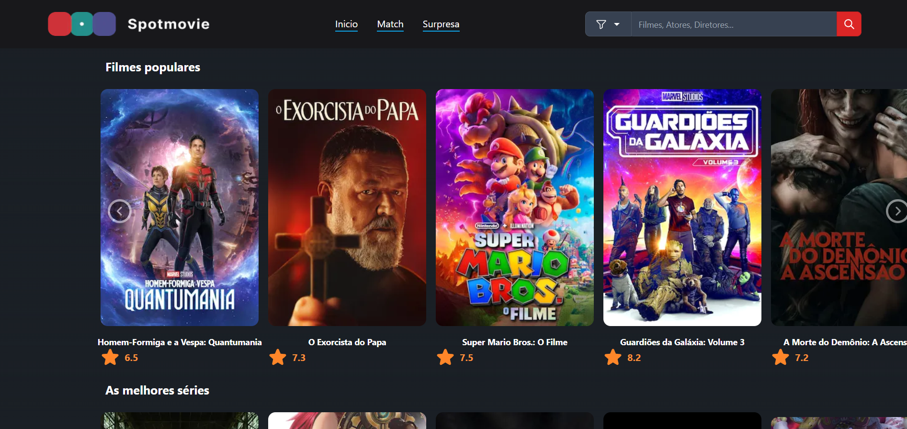
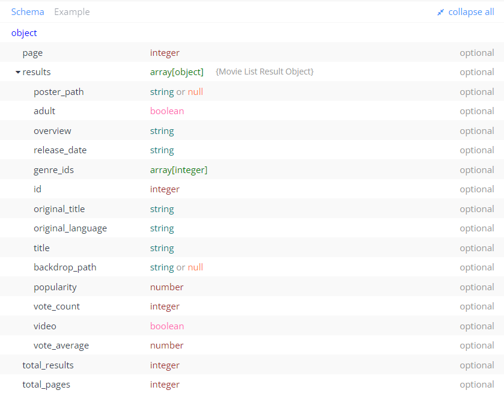
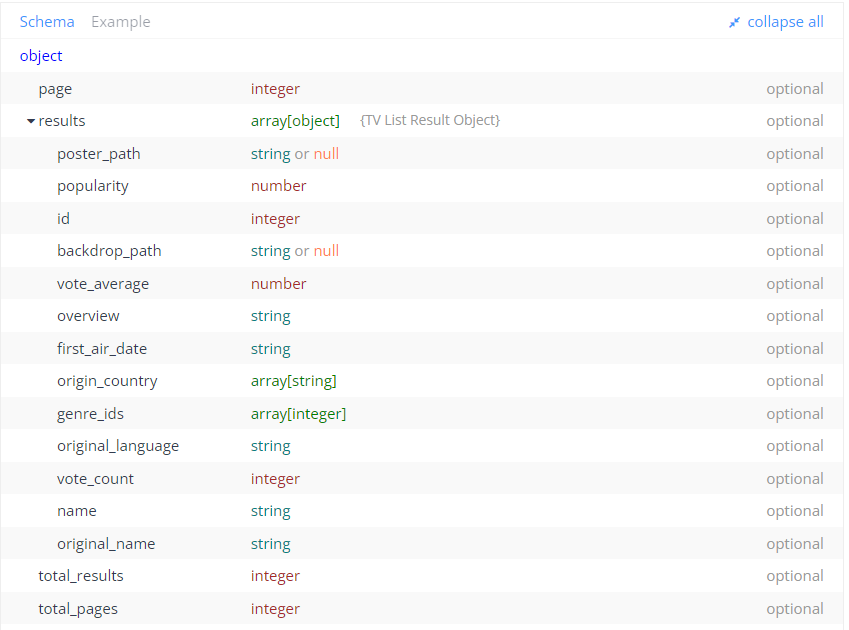
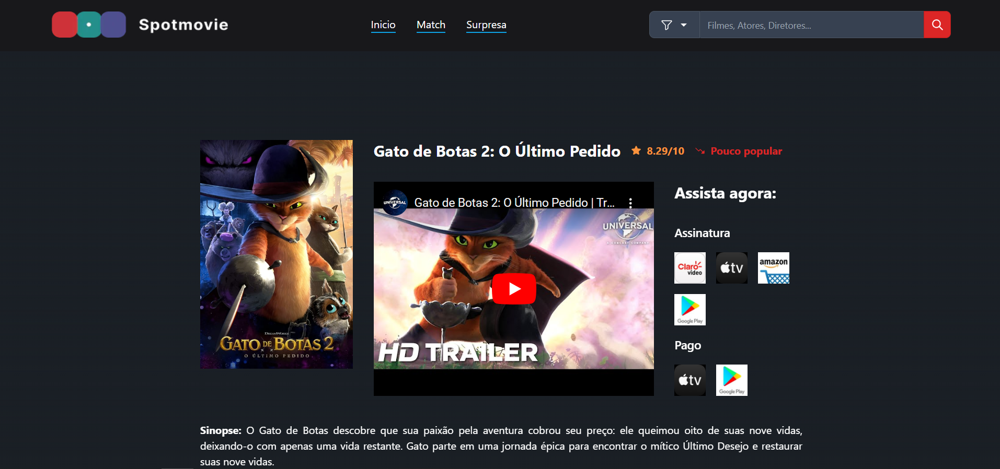
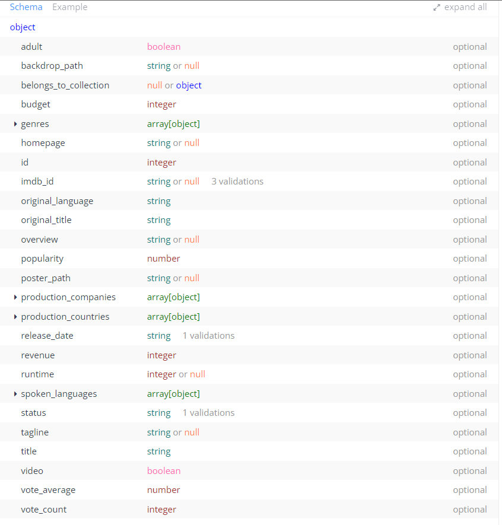
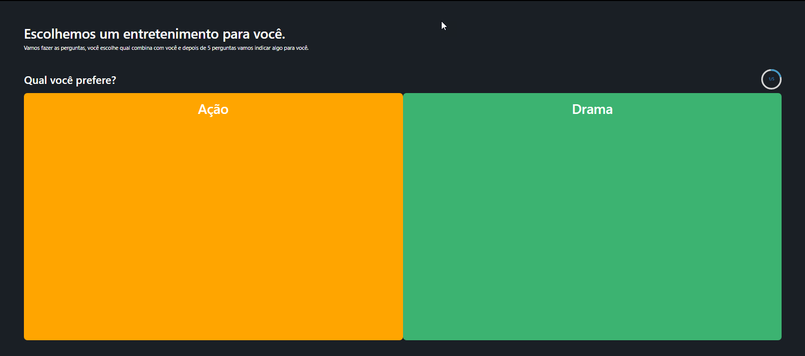

# Programação de Funcionalidades

Nesta seção são apresentadas as telas desenvolvidas para cada uma das funcionalidades do sistema.

## Página inicial (RF-01)
A tela principal do sistema apresenta uma lista de conteúdos de mídia, como filmes e séries, divididos por seções, além de que, cada um destes, traz a nota que recebeu do público geral. Os dados são buscados da API The Movie Database, conforme supracitado. Além disso, a página inicial, bem como as outras, apresentam uma navbar que permite a navegação entre as áreas do site, e que também contém um campo de pesquisa que será implementado em sequência. Desenvolvida pelo membro do grupo Juan Andrade.

* Requisitos atendidos: RF-01
* Artefatos da funcionalidade: src/pages/index.tsx
* Estrutura de Dados
  * Busca de filmes
  
  * Busca de séries
  
* Instruções de acesso
  1. Acesse a URL do projeto
  2. A tela principal é a primeira funcionalidade exibida pelo website.

## Ver filme/série específica (RF-04)
Ao clicar em um filme na tela principal ou ao buscar um filme pela barra de pesquisa, a tela a seguir permite com que o usuário veja informações mais detalhadas acerca do conteúdo de mídia buscado, como o nome completo, trailer do conteúdo, sinopse e avaliação do público. A tela foi desenvolvida pelo membro Arthur Costa.

 

* Requisitos atendidos: RF-04
* Artefatos da funcionalidade: src/pages/movie/[id].tsx; src/pages/series/[id].tsx;
* Estrutura de Dados
 
* Instruções de acesso
  1. Acesse a URL do projeto
  2. Na tela principal, clique no banner de um dos filmes mostrados
  3. A tela de ver filme/série, será a tela mostrada em seguida

## Tela de match (RF-04)
Baseado no uso da plataforma, o usuário poderá selecionar temas e tópicos e sua preferência, com base nisso o sistema deve coletar as informações e retornar sugestões conforme as escolhas que foram feitas. Tela desenvolvida por Aaron Carvalho.

 

* Requisitos atendidos: RF-04
* Artefatos da funcionalidade: src/pages/match
* Estrutura de Dados: as estruturas utilizadas são as mesmas exibidas acima nas figuras 13 -busca de séries- e 14 - busca de mídia específica-.

