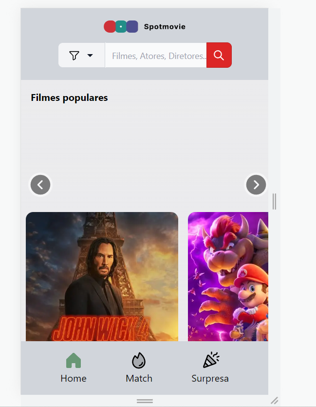
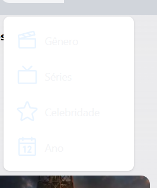

# Registro de Testes de Software

Os resultados obtidos nos testes de software realizados são descritos abaixo. 

## CT-01: Tela inicial

* A tela está devidamente populada e retornando todos os resultados retornados pela API TMDB
* A tela permite rolamento horizontal conforme o esperado
* A tela está de acordo com o design, mas com ressalvas:
  * Na tela mobile, os botões de rolamento ficam fora da área esperada

## CT-02: Barra de pesquisa

* A barra de pesquisa está devidamente implementada
* A tela de resultados retorna resultados coerentes
* A barra de pesquisa está de acordo com o design, mas com ressalvas:
  * Em light mode a barra de pesquisa está com contraste inacessível

